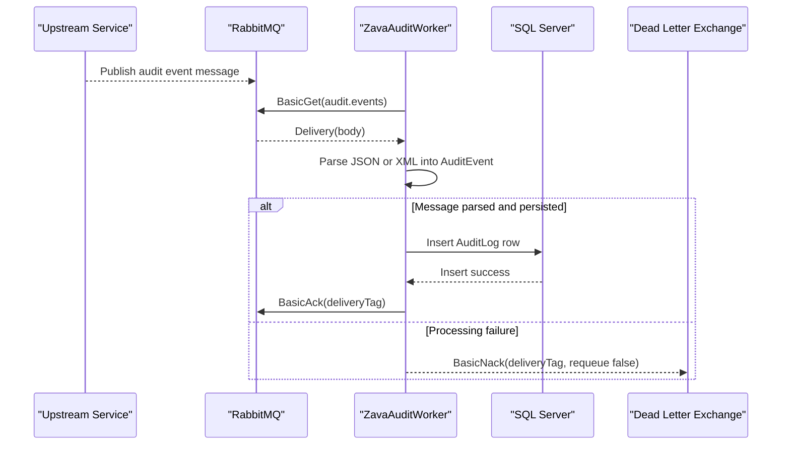

# API & Service Communication Contracts

The application does not expose HTTP APIs; it operates as a queue-driven background worker with synchronous SQL writes. Service communication is primarily RabbitMQ message consumption followed by SQL Server persistence.

## Service Catalog

| Service | Port | Category | Purpose |
|---|---|---|---|
| ZavaAuditWorker | N/A (console worker) | Business | Consumes audit messages and persists audit records |
| RabbitMQ broker | 5672 (configured default) | Infrastructure | Delivers audit messages from `audit.events` queue |
| SQL Server | 1433 (configured default) | Infrastructure | Stores audit data in `AuditLog` and optional `AuditActions` |

## API Endpoints Inventory

> No HTTP endpoint definitions were found. This process is queue-triggered and has no REST surface.

## Management & Observability Endpoints

| Service | Endpoint | Custom Metrics (if any) |
|---|---|---|
| ZavaAuditWorker | None detected | None detected |

## DTOs & Contracts

The primary message contract is the `AuditEvent` class, used as an internal normalized representation for both JSON and XML payloads. Request contracts are implicit RabbitMQ message bodies; responses are RabbitMQ acknowledgement (`BasicAck`) or dead-letter routing (`BasicNack` with requeue false). No OpenAPI, protobuf, or GraphQL contract files were found.

## Communication Patterns

- **Asynchronous ingestion**: Worker polls RabbitMQ queue (`BasicGet`) for one message per cycle.
- **Synchronous persistence**: Parsed events are written with direct SQL commands through `SqlConnection`.
- **Fallback behavior**: On processing failure, message is negatively acknowledged and dead-lettered.
- **Service discovery**: None; host/port are configured directly through environment variables or app settings.
- **Security posture**: No TLS transport configuration, token auth, or authorization layer is present in worker-to-broker or worker-to-database calls.

## Service Technology Matrix

| Service | Web | Data Access | Discovery | Gateway | Actuator | Cache | Metrics |
|---|---|---|---|---|---|---|---|
| ZavaAuditWorker | None | ADO.NET SqlClient | None | None | None | None | None |

## Service Communication Sequence

