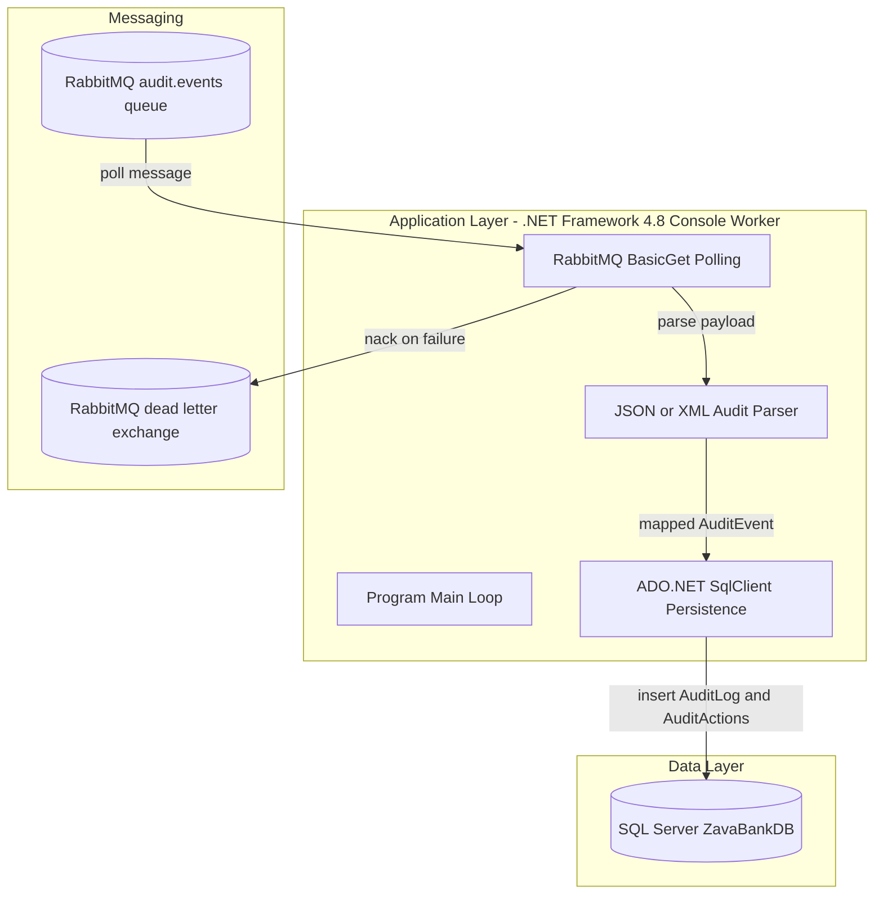
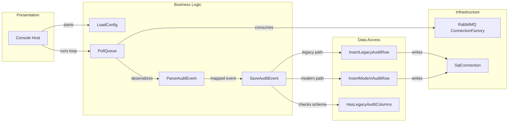

# Architecture Diagram

This repository contains a single .NET Framework console worker that polls RabbitMQ for audit events and persists them to SQL Server.

## Application Architecture

### Technology Stack Summary

| Layer | Technology | Version | Purpose |
|---|---|---|---|
| Application | .NET Framework Console App | 4.8 | Long-running worker process |
| Messaging | RabbitMQ.Client | 5.2.0 | Pulls audit events and acknowledges/nacks deliveries |
| Data Access | System.Data.SqlClient | .NET Framework built-in | Inserts parsed audit records into SQL Server |
| Serialization | JavaScriptSerializer, XDocument | .NET Framework built-in | Parses JSON and XML payloads |

### Data Storage & External Services

The worker writes audit entries to SQL Server tables (`AuditLog`, optionally `AuditActions`) and consumes messages from RabbitMQ (`audit.events`). Failed messages are dead-lettered through a configured exchange.

### Key Architectural Decisions

- Uses a polling worker loop with graceful shutdown and configurable poll interval.
- Supports dual message formats (JSON and XML) with a shared `AuditEvent` model.
- Detects legacy versus modern `AuditLog` schema at runtime and writes compatible records.

## Component Relationships

### Component Inventory

| Component | Layer | Type | Responsibility |
|---|---|---|---|
| `Program.Main` | Presentation | Console entry point | Starts worker lifecycle and shutdown hooks |
| `LoadConfig` | Business Logic | Configuration loader | Resolves app settings and environment overrides |
| `PollQueue` | Business Logic | Message polling routine | Reads one RabbitMQ message per cycle and routes success/failure |
| `ParseAuditEvent` | Business Logic | Parser coordinator | Detects payload format and maps to `AuditEvent` |
| `SaveAuditEvent` | Business Logic | Persistence coordinator | Chooses legacy or modern insert strategy |
| `InsertLegacyAuditRow` | Data Access | SQL command routine | Writes old-schema audit rows with action lookup |
| `InsertModernAuditRow` | Data Access | SQL command routine | Writes new-schema audit rows directly |
| `ConnectionFactory` / `SqlConnection` usage | Infrastructure | Client libraries | External connectivity to RabbitMQ and SQL Server |
