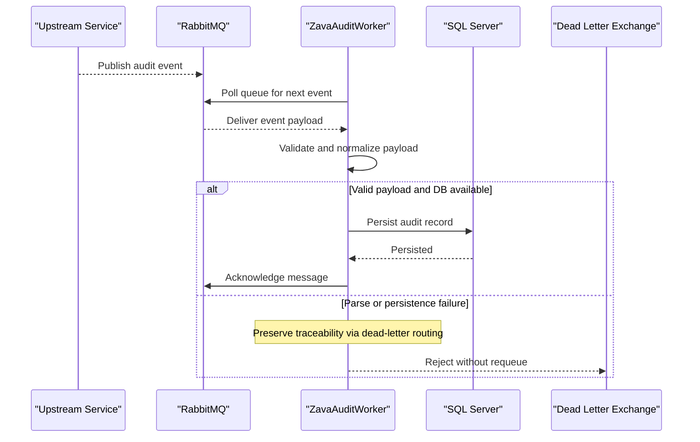

# Core Business Workflows

The application processes audit events generated by upstream systems and ensures they are durably recorded for traceability. Its core business behavior is reliable message ingestion, normalization, and persistence with dead-letter fallback.

## Domain Entities

| Entity | Service / Bounded Context | Description | Key Relationships |
|---|---|---|---|
| AuditEvent | Audit Ingestion | Normalized in-memory representation of incoming audit payload | Mapped to `AuditLog` persistence formats |
| AuditLog | Audit Persistence | Durable record of user/service event activity | Optionally references `AuditActions` in legacy schema mode |
| AuditActions | Audit Persistence | Catalog of known action names for legacy schema inserts | Referenced by `AuditLog.ActionID` |

## Service-to-Domain Mapping

| Service | Domain Context | Owned Entities | External Dependencies |
|---|---|---|---|
| ZavaAuditWorker | Audit Ingestion and Persistence | AuditEvent, AuditLog, AuditActions | RabbitMQ broker, SQL Server |

## Primary Workflows

### Workflow 1: Consume and Persist Audit Event

1. Worker polls `audit.events` queue.
2. Payload is parsed (JSON or XML) into `AuditEvent`.
3. Worker checks storage schema mode.
4. Event is persisted to legacy or modern audit schema.
5. Message is acknowledged on success.

### Workflow 2: Failure Handling and Dead-Lettering

1. Worker receives message payload.
2. Parsing or DB persistence fails.
3. Worker rejects message without requeue.
4. Broker routes message to dead-letter exchange for later inspection/replay.

## Cross-Service Data Flows

Upstream services publish audit messages to RabbitMQ, while ZavaAuditWorker is the single consumer in this repository. The worker transforms each message and persists it into SQL Server; if processing fails, the business outcome is degraded to dead-letter storage rather than silent loss.

## Business Workflow Sequence

## Business Rules & Decision Logic

- Message format rule: XML payloads are parsed as XML, otherwise JSON parsing is used.
- Schema compatibility rule: Worker uses legacy insert path when `AuditLog.ActionID` exists; otherwise modern insert path.
- Reliability rule: success leads to explicit ack, failure leads to dead-lettering to prevent infinite retries.
- Data completeness rule: when values are missing, fields may be persisted as null while retaining raw payload details.
