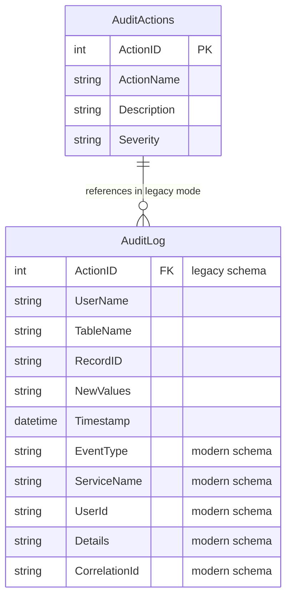

# Data Architecture & Persistence Layer

The data layer is SQL Server-backed and accessed through direct ADO.NET commands without an ORM. The worker persists audit events into legacy or modern `AuditLog` schemas based on runtime schema inspection.

## Database Configuration

| Service/Module | DB Type | Profile | Driver | Connection | Migration Tool |
|---|---|---|---|---|---|
| ZavaAuditWorker | SQL Server | Default | System.Data.SqlClient | From `DB_CONNECTION_STRING` or `Database.ConnectionString` (fallback host `sqlserver`, port `1433`) | None detected |

## Data Ownership per Service

| Service | Tables Owned | ORM Framework | Caching | Notes |
|---|---|---|---|---|
| ZavaAuditWorker | `AuditLog`, `AuditActions` | None (ADO.NET) | None | Uses schema probe to decide legacy (`ActionID` path) vs modern insert path |

## Entity Model

## Key Repository Methods

| Service | Repository | Notable Methods | Purpose |
|---|---|---|---|
| ZavaAuditWorker | Inline SQL in `Program.cs` | `HasLegacyAuditColumns()` | Detects schema mode by checking for `ActionID` column |
| ZavaAuditWorker | Inline SQL in `Program.cs` | `EnsureAction(connection, eventType)` | Upserts action metadata into `AuditActions` and returns `ActionID` |
| ZavaAuditWorker | Inline SQL in `Program.cs` | `InsertLegacyAuditRow(connection, auditEvent)` | Persists events to legacy audit schema |
| ZavaAuditWorker | Inline SQL in `Program.cs` | `InsertModernAuditRow(connection, auditEvent)` | Persists events to modern audit schema |

## Caching Strategy

No cache provider, cache annotations, or cache-aside/read-through patterns were detected in this repository.

## Data Ownership Boundaries

A single worker owns writes to audit persistence tables in one SQL Server database. No cross-service direct database reads/writes or CQRS split patterns are defined in code.

### Data Classification & Sensitivity

| Entity | Sensitive Fields | Classification (PII/PHI/PCI/None) | Controls in Place |
|---|---|---|---|
| `AuditLog` | `UserId`/`UserName`, message payload fields in `Details`/`NewValues` | PII (possible) | No explicit masking, field encryption, or access control logic in this repository |
| `AuditActions` | None obvious | None | Not applicable |
