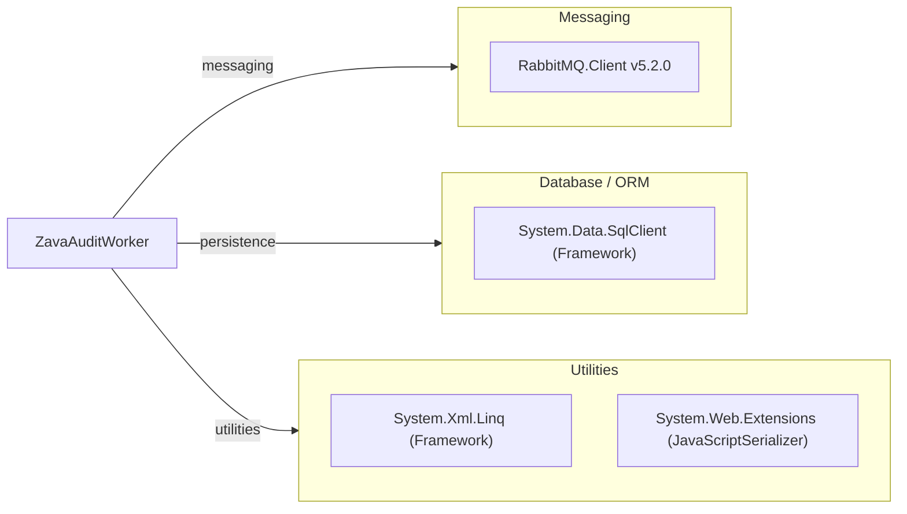

# Dependency Map

This project is a single .NET Framework worker with one declared external package dependency and core framework assemblies.

## Dependencies

### Dependency Summary

| Category | Count | Key Libraries | Notes |
|---|---:|---|---|
| Messaging | 1 | RabbitMQ.Client 5.2.0 | Declared via `packages.config`; used for queue polling and ack/nack |
| Database / ORM | 1 | System.Data.SqlClient | Direct ADO.NET operations against SQL Server |
| Utilities | 2 | System.Xml.Linq, System.Web.Extensions | XML and JSON payload parsing |

### Version & Compatibility Risks

The app targets .NET Framework 4.8, which is Windows-focused and limits Linux-native build/hosting workflows. RabbitMQ.Client 5.2.0 is significantly old compared to current 6.x+ lines and may require API adjustments during modernization.

### Notable Observations

- No ORM package is used; SQL is embedded in command text with parameterized statements.
- Dependency surface is intentionally small, centered around RabbitMQ connectivity.
- No explicit observability or resilience dependency (for example Polly) is declared.

## Test Dependencies

No test dependencies detected.

Total test-scope dependencies: 0
No test project or test package references were found in this repository.
