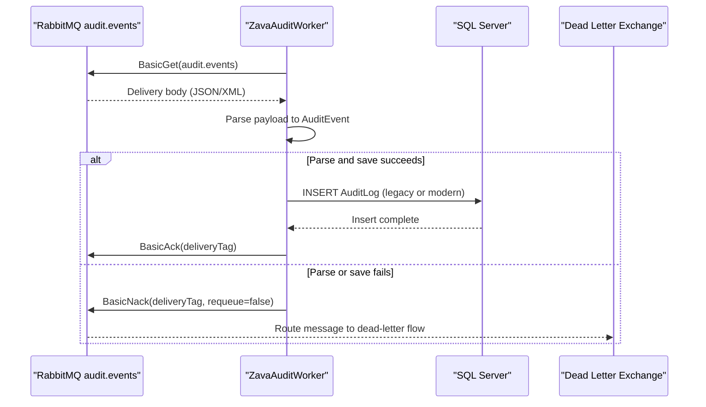

# API & Service Communication Contracts

This project exposes no HTTP API surface and instead implements asynchronous service communication by consuming audit events from RabbitMQ and writing to SQL Server.

## Service Catalog

| Service | Port | Category | Purpose |
|---|---|---|---|
| ZavaAuditWorker | N/A (worker process) | Business | Consumes audit messages, normalizes payloads, and persists audit records |
| RabbitMQ Broker | 5672 | Infrastructure | Hosts queue `audit.events` and dead-letter exchange `zava.dlx` |
| SQL Server | 1433 | Infrastructure | Stores audit event records |

## API Endpoints Inventory

| Service | Method | Path | Request Type | Response Type |
|---|---|---|---|---|
| ZavaAuditWorker | N/A | N/A | RabbitMQ message body (JSON/XML) | SQL write + message ack/nack |

## Management & Observability Endpoints

| Service | Endpoint | Custom Metrics (if any) |
|---|---|---|
| ZavaAuditWorker | None detected | None detected |

## DTOs & Contracts

The key contract type is `AuditEvent`, which acts as the normalized in-memory representation for message payloads before persistence. The worker accepts JSON and XML message bodies and maps them to this common contract (`eventType`, `serviceName`, `userId`, `timestamp`, `details`, `correlationId` semantics). No OpenAPI/Swagger, protobuf, or GraphQL schemas are defined.

## Communication Patterns

Communication is asynchronous from RabbitMQ to the worker (`BasicGet` polling). Persistence is synchronous from worker to SQL Server through ADO.NET commands. Error handling uses negative acknowledgment (`BasicNack`) without requeue to route failed messages to dead-letter handling. No API gateway, service discovery, TLS setup, or explicit authentication/authorization controls are configured at the worker communication layer in this repository.

## Service Technology Matrix

| Service | Web | Data Access | Discovery | Gateway | Actuator | Cache | Metrics |
|---|---|---|---|---|---|---|---|
| ZavaAuditWorker | None | ADO.NET SQL commands | None | No | No | None | None |

## Service Communication Sequence

