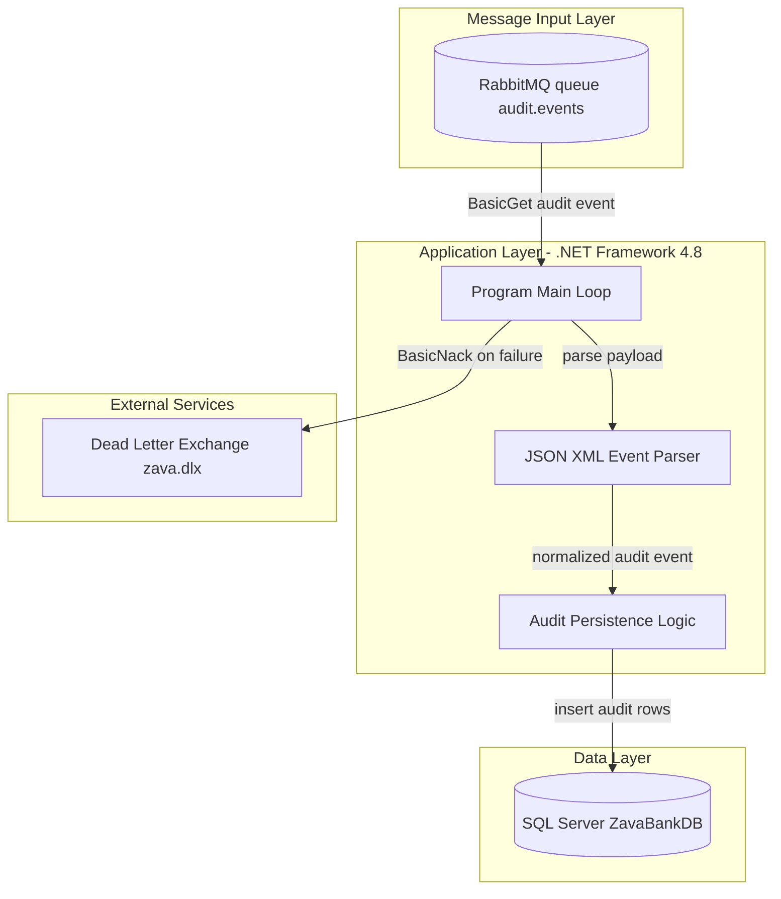
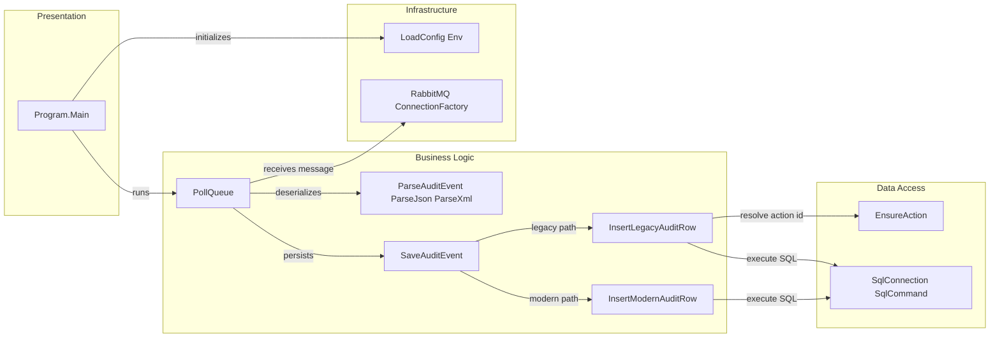

# Architecture Diagram

This repository contains a single background worker application that consumes audit messages from RabbitMQ and persists them into SQL Server.

## Application Architecture

### Technology Stack Summary

| Layer | Technology | Version | Purpose |
|---|---|---|---|
| Application | .NET Framework Console App | 4.8 | Long-running worker process |
| Messaging | RabbitMQ.Client | 5.2.0 | Queue polling and message ack/nack |
| Data Access | ADO.NET `SqlConnection`/`SqlCommand` | System.Data (framework) | SQL write operations |
| Data Store | SQL Server | Not pinned in repo | Persistent audit storage |

### Data Storage & External Services

The worker depends on RabbitMQ as the event source and SQL Server as the persistent audit store. On processing failures it negatively acknowledges messages, routing to the configured dead-letter exchange.

### Key Architectural Decisions

- Poll-based worker loop uses `BasicGet` and explicit ack/nack handling for deterministic message completion.
- Supports both legacy and modern `AuditLog` schemas by checking for `ActionID` column at runtime.
- Reads configuration from environment variables first, then app settings, enabling externalized deployment configuration.

## Component Relationships

### Component Inventory

| Component | Layer | Type | Responsibility |
|---|---|---|---|
| Program.Main | Presentation | Entry point | Starts worker lifecycle and poll loop |
| LoadConfig/Env helpers | Infrastructure | Configuration utility | Loads settings from env + app config |
| PollQueue | Business Logic | Orchestrator | Retrieves messages and coordinates processing |
| ParseAuditEvent/ParseJson/ParseXml | Business Logic | Parser | Normalizes message payload to `AuditEvent` |
| SaveAuditEvent | Business Logic | Persistence coordinator | Chooses legacy or modern insert path |
| EnsureAction | Data Access | SQL helper | Resolves/inserts action metadata for legacy schema |
| InsertLegacyAuditRow | Business Logic | Persistence operation | Writes legacy `AuditLog` record |
| InsertModernAuditRow | Business Logic | Persistence operation | Writes modern `AuditLog` record |
