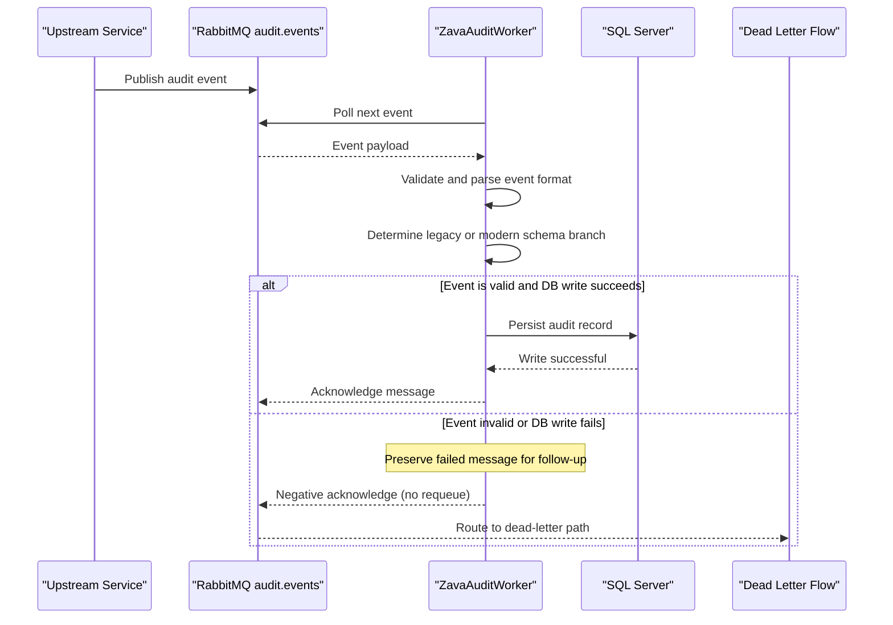

# Core Business Workflows

This application’s business function is to reliably process audit events from a message queue and persist them in a normalized audit trail for downstream compliance and investigation use.

## Domain Entities

| Entity | Service / Bounded Context | Description | Key Relationships |
|---|---|---|---|
| AuditEvent | Audit Processing | In-memory representation of inbound audit payload | Drives writes to `AuditLog`; event type resolves `AuditActions` in legacy path |
| AuditLog | Audit Persistence | Persistent record of audit activity | Can reference `AuditActions` for categorized legacy entries |
| AuditActions | Audit Persistence | Legacy action catalog used to classify events | One action can map to many audit log records |

## Service-to-Domain Mapping

| Service | Domain Context | Owned Entities | External Dependencies |
|---|---|---|---|
| ZavaAuditWorker | Audit Processing and Persistence | AuditEvent, AuditLog write behavior, AuditActions resolution | RabbitMQ queue, SQL Server |

## Primary Workflows

### Workflow 1: Process and Persist Audit Event

1. Worker polls `audit.events` from RabbitMQ.
2. Message payload is parsed as JSON or XML into normalized `AuditEvent` data.
3. Business decision selects persistence branch by schema compatibility check (`ActionID` column existence).
4. Event is inserted into SQL Server using legacy or modern write path.
5. Message is acknowledged on success.
6. On parsing/persistence failure, message is negatively acknowledged and routed to dead-letter handling.

## Cross-Service Data Flows

The workflow composes data across infrastructure boundaries: RabbitMQ provides the event source, the worker performs normalization and routing decisions, and SQL Server stores the final audit record. When write processing fails, the business outcome degrades to deferred handling through dead-letter routing, preserving evidence for later reprocessing.

## Business Workflow Sequence

## Business Rules & Decision Logic

- Parsing rule: input is treated as XML if payload starts with `<`; otherwise JSON parser is used.
- Timestamp rule: when timestamp parsing fails, current server time is used.
- Schema compatibility rule: if `AuditLog.ActionID` exists, legacy insertion with `AuditActions` lookup/creation is used; otherwise modern insertion is used.
- Reliability rule: successful persistence must occur before message acknowledgment; failures route message to dead-letter handling.
