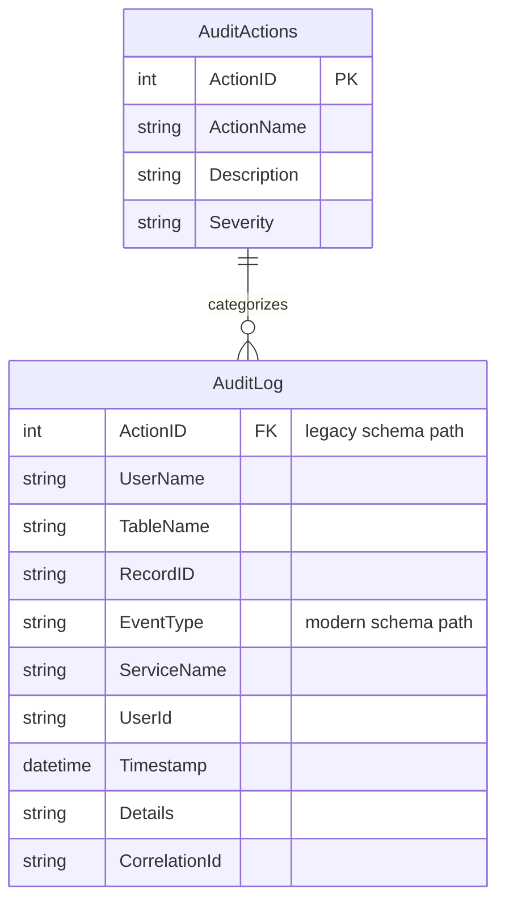

# Data Architecture & Persistence Layer

The data layer is implemented with direct SQL access to SQL Server using ADO.NET, with runtime handling for both legacy and modern audit table shapes.

## Database Configuration

| Service/Module | DB Type | Profile | Driver | Connection | Migration Tool |
|---|---|---|---|---|---|
| ZavaAuditWorker | SQL Server | Default/env-driven | `System.Data.SqlClient` | Connection string from env or `Database.ConnectionString` app setting | None detected |

## Data Ownership per Service

| Service | Tables Owned | ORM Framework | Caching | Notes |
|---|---|---|---|---|
| ZavaAuditWorker | `AuditLog`, `AuditActions` | None (raw ADO.NET) | None | Supports both legacy (`ActionID`) and modern (`EventType` etc.) `AuditLog` schema |

## Entity Model

## Key Repository Methods

| Service | Repository | Notable Methods | Purpose |
|---|---|---|---|
| ZavaAuditWorker | Program (ADO.NET commands) | `HasLegacyAuditColumns()` | Detects active audit schema mode |
| ZavaAuditWorker | Program (ADO.NET commands) | `EnsureAction(connection, eventType)` | Resolves or inserts action metadata in `AuditActions` |
| ZavaAuditWorker | Program (ADO.NET commands) | `InsertLegacyAuditRow(connection, auditEvent)` | Writes legacy audit format |
| ZavaAuditWorker | Program (ADO.NET commands) | `InsertModernAuditRow(connection, auditEvent)` | Writes modern audit format |

## Caching Strategy

No application-level caching provider or cache policy is configured. All writes are executed directly against SQL Server during message processing.

## Data Ownership Boundaries

The worker owns write access logic for audit persistence tables and relies on a single shared SQL Server datastore. No cross-service direct database access patterns are visible in this repository; integration occurs through inbound RabbitMQ messages.

### Data Classification & Sensitivity

| Entity | Sensitive Fields | Classification (PII/PHI/PCI/None) | Controls in Place |
|---|---|---|---|
| AuditLog | `UserName`/`UserId`, potential personal data in `Details` | PII (potential) | No explicit masking or field-level protection in code |
| AuditActions | None obvious | None | N/A |
