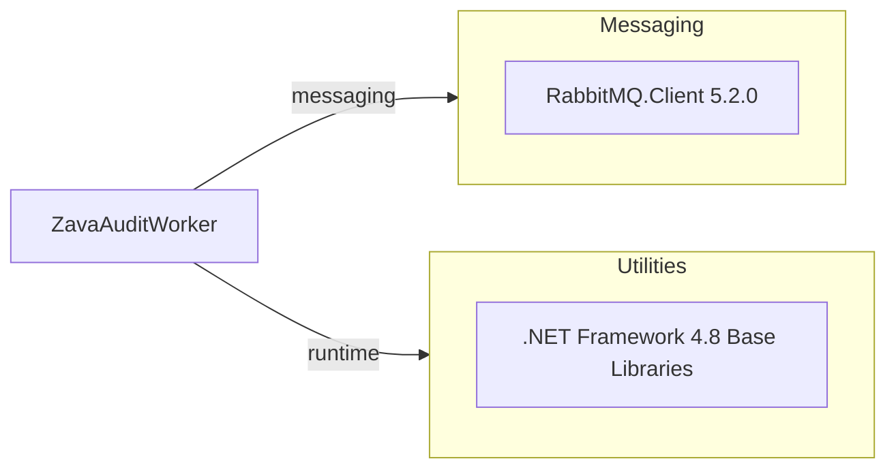

# Dependency Map

This .NET Framework worker project declares a small dependency set centered on messaging and base framework libraries.

## Dependencies

### Dependency Summary

| Category | Count | Key Libraries | Notes |
|---|---:|---|---|
| Messaging | 1 | RabbitMQ.Client 5.2.0 | Core queue integration library |
| Utilities | 1 | .NET Framework 4.8 runtime libraries | Includes System.Data, System.Configuration, XML/JSON support |

### Version & Compatibility Risks

The project targets .NET Framework 4.8 and C# 7.3, which can constrain modernization paths compared with modern .NET SDK-style projects. RabbitMQ.Client 5.2.0 is older than current major versions and may require API adjustments during framework upgrades.

### Notable Observations

- Dependency footprint is minimal, reducing migration complexity.
- Package management uses legacy `packages.config` and non-SDK `.csproj` format.
- No explicit observability, resiliency, or testing packages are declared.

## Test Dependencies

| Framework | Version | Notes |
|---|---|---|
| None detected | N/A | No test-scoped dependencies declared in project files |

Total test-scope dependencies: 0
No test dependencies detected.
